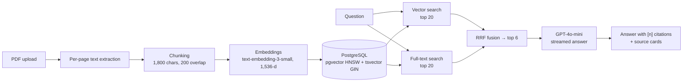

# Hybrid RAG Knowledge System

Ask questions across your PDFs and get streamed answers with page-level source citations.
Retrieval combines **pgvector semantic search** and **PostgreSQL full-text search**, fused with
**Reciprocal Rank Fusion (RRF)**. A built-in evaluation harness measures whether hybrid retrieval
actually beats either method alone.

**Stack:** Next.js, TypeScript, OpenAI (GPT-4o-mini, text-embedding-3-small), LangChain.js,
PostgreSQL, pgvector.



## Features

- **PDF ingestion:** per-page text extraction, 1,800-character chunks with 200-character overlap
  (chunks never cross pages, so citations point to the exact page), 1,536-dimensional embeddings,
  SHA-256 de-duplication so re-uploading a file is free.
- **Hybrid retrieval:** cosine similarity over an HNSW index plus full-text search over a GIN index,
  fused with RRF (k = 60). RRF uses ranks only, so similarity scores and `ts_rank` scores never need
  to be calibrated against each other.
- **Multi-document search:** search everything, or tick specific documents to restrict retrieval.
- **Streaming with citations:** the API streams newline-delimited JSON. Sources arrive first, then
  tokens, then the list of sources the answer actually cited. The UI turns `[2]` into a link to
  source card 2 and highlights cited sources.
- **Evaluation harness:** a golden question set, Recall@6, MRR@6, Recall@1 and latency for vector,
  keyword and hybrid retrieval, plus LLM-as-judge faithfulness and answer accuracy.

## Quick start

```bash
git clone https://github.com/vkxr/hybrid-rag-knowledge-system.git && cd hybrid-rag-knowledge-system
npm install
docker compose up -d                    # Postgres 16 + pgvector
cp .env.example .env.local              # add OPENAI_API_KEY
set -a && source .env.local && set +a   # export for the scripts
npm run db:migrate
npm run dev                             # http://localhost:3000
```

Bulk-load a folder of PDFs instead of using the UI:

```bash
npm run ingest -- ./corpus
```

## API

| Method | Route | Body / response |
|---|---|---|
| `POST` | `/api/upload` | multipart `files` (PDFs, max 20 MB each) → `{ results: [{ documentId, chunks, pages, duplicate }] }` |
| `GET` | `/api/documents` | `{ documents: [{ id, name, pageCount, chunkCount }] }` |
| `DELETE` | `/api/documents/:id` | removes the document and its chunks |
| `POST` | `/api/chat` | `{ question, documentIds?, mode?: "hybrid" \| "vector" \| "keyword" }` → NDJSON stream of `sources`, `token`, `done`, `error` events |

## Evaluation

1. Ingest your corpus (a few public reports or policy documents work well, 100+ pages in total).
2. Generate candidate questions from randomly sampled chunks:
   ```bash
   npm run eval:golden -- --n 100
   ```
3. **Review `eval/golden.json` by hand.** Fix or delete vague questions, questions answerable from
   general knowledge, and questions several chunks answer equally well. Mark each checked item
   `"reviewed": true`.
4. Run the evaluation:
   ```bash
   npm run eval                 # all three retrieval modes + judged answers for hybrid
   npm run eval -- --no-judge   # retrieval only, no chat-model cost
   npm run eval -- --judge-all  # judge answers for every mode
   ```

Results are written to `eval/results/` as JSON (per-question detail) and a Markdown table.

| Metric | Meaning |
|---|---|
| Recall@6 | Share of questions whose source chunk is among the 6 chunks sent to the model |
| MRR@6 | Mean of 1 / rank of the source chunk (0 if outside the top 6) |
| Faithfulness | Share of the answer's claims supported by the retrieved sources (LLM judge) |
| Answer accuracy | Share of answers that contain the reference answer's key facts (LLM judge) |

<!-- Paste your results table here after running the eval. -->

## Design notes

- **OR-semantics keyword search.** `websearch_to_tsquery` ANDs every term, so a natural question
  like "how many days for a refund" matches nothing unless one chunk contains every word. Queries
  are parsed with `websearch_to_tsquery` (stemming, stop words, quoted phrases) and the ANDs are
  turned into ORs; `ts_rank_cd` still ranks chunks matching more terms higher. Quoted phrases stay
  phrases.
- **Embed before insert.** Embeddings are computed before any row is written, and a failed insert
  deletes the document, so a failure never leaves a half-indexed file.
- **Golden items survive re-ingestion.** They reference `document name + chunk index` rather than
  database ids.
- **Tests run on real Postgres.** The test suite uses PGlite (Postgres compiled to WebAssembly) with
  the pgvector extension, so the SQL in `lib/retrieval.ts` is exercised as written, with no API keys.

## Project layout

```
app/                Next.js UI and API routes
lib/chunking.ts     PDF text extraction and chunking
lib/ingest.ts       embedding + storage, de-duplication
lib/retrieval.ts    vector search, full-text search, RRF
lib/answer.ts       prompt, streaming, citations
lib/judge.ts        LLM-as-judge scorers
lib/metrics.ts      Recall@k, MRR, percentiles
eval/               golden set generator and evaluation runner
test/               Vitest suite (PGlite + pgvector)
```

## License

MIT
